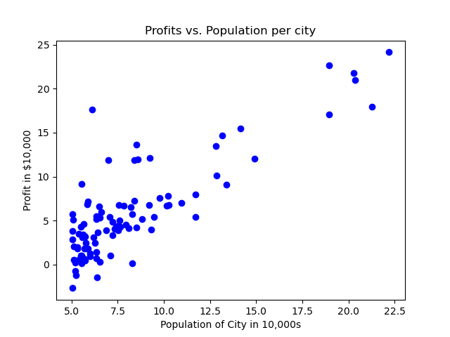
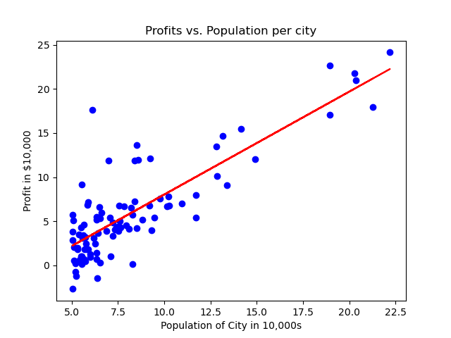

# Predictive Modeling for Restaurant Profit Optimization

## Problem Statement

- This project involves predicting restaurant profits based on city populations.
- As the CEO of a restaurant franchise, you are considering different cities for opening a new outlet.
- The goal is to use linear regression to analyze existing data on city populations and restaurant profits to determine which cities may yield higher returns.

## Installation

To set up the environment, install the required dependencies:

```bash
pip install -r requirements.txt
```

## Usage

1. Clone the repository:

```bash
git clone https://github.com/PratikNichite/Predictive-Modeling-for-Restaurant-Profit-Optimization.git
cd Predictive-Modeling-for-Restaurant-Profit-Optimization-main
```

2. Open jupyter notebook:

```bash
jupyter notebook code.ipynb
```

3. Run the notebook cells sequentially.

## Dataset

- The dataset used in this project was gathered from a Machine Learning course from Coursera (taught by Andrew Ng).
- Ensure the dataset is placed in the appropriate directory before running the notebook.

## Dataset Visualization



- The following diagram shows the scatter plot of city populations versus restaurant profits:

## Results



- The analysis shows a positive correlation between city population and restaurant profit, meaning larger populations are likely to yield higher profits.
- This model helps predict potential profits for new locations.
